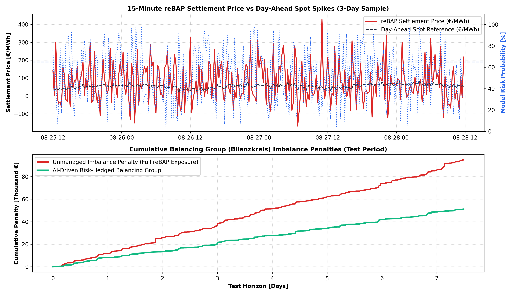

# ⚖️ German reBAP Imbalance Settlement & Bilanzkreis Risk Prediction

A quantitative energy data analytics engine forecasting 15-minute **System Balance States (Net Regulation Volume / NRV)** and **reBAP Imbalance Settlement Prices** (*regelarbeitsbezogener Ausgleichspreis*) across the German transmission grid (50Hertz, Amprion, TenneT, TransnetBW).

---

## 📌 Market Context & Risk Mechanisms

* **Bilanzkreis Responsibility:** German market participants face substantial penalties when real-time consumption/generation deviates from submitted Day-Ahead schedules (Fahrpläne).
* **System Short vs System Long Dynamics:**
  * **System Short ($NRV < 0$):** High positive balancing energy activations (aFRR/mFRR) drive reBAP prices to extreme spikes ($>€500/MWh$), punishing short balancing groups.
  * **System Long ($NRV > 0$):** Excess renewable dumping depresses reBAP prices into negative territory.
* **Algorithmic Risk Hedging:** Automated Intraday pre-balancing triggered when the ML model signals a high probability ($P > 65\%$) of systemic grid deficits.

---

## 📊 Financial Risk Benchmark & Value-at-Risk (Test Period: 720 Quarter-Hours)

| Metric | Unmanaged (Blind reBAP) | AI-Hedged Balancing Group | Optimization Uplift |
| :--- | :---: | :---: | :---: |
| **Cumulative Imbalance Penalty** | **€94,833.48** | **€51,154.44** | **-€43,679.04 (-46.1%)** |
| **15-Min 95% Value at Risk (VaR)** | **€605.95 / 15m** | **€347.98 / 15m** | **-42.6% VaR Compression** |
| **System Balance State ROC-AUC** | Baseline | **0.645** | Predictive Feature Edge |

---

## 📈 Visual Benchmark: reBAP Spreads & Penalty Trajectory

---

## 🛠️ Tech Stack
* **Language:** Python 3.10+
* **Machine Learning & Analytics:** `scikit-learn`, `pandas`, `numpy`
* **Visualization:** `matplotlib`
